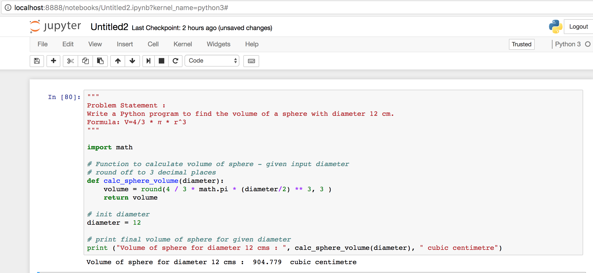
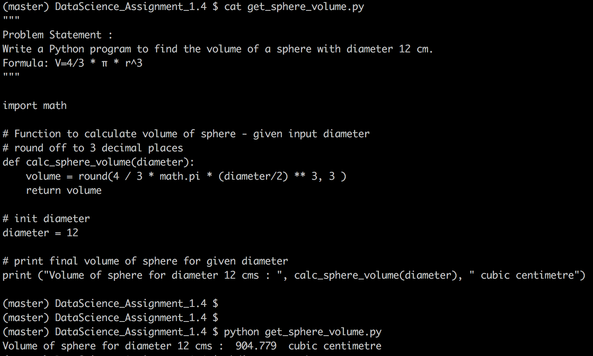

# Problem Statement :
```
Write a Python program to find the volume of a sphere with diameter 12 cm.
Formula: V=4/3 * π * r^3
```

## Snapshot - Run from jupyter REPL 
```
import get_sphere_volume.ipynb in jupyter REPL 
```




## Snapshot - Run from command line bash
```
Command to execute : python get_sphere_volume.py
```


